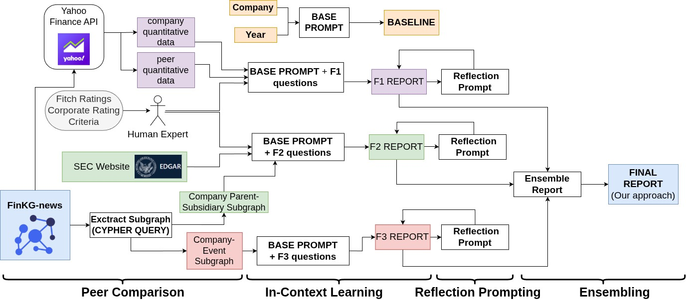

# Financial Risk Report Generation

This directory contains notebooks for generating financial credit risk reports using FinKG-news and LLMs.



## Contents

- **`financial_risk_report_generation.ipynb`** — Main notebook. Generates credit risk reports for a list of companies using data from FinKG-news (Neo4j graph), Yahoo Finance and SEC website.
- **`report_evaluation.ipynb`** — Evaluation notebook. Uses an LLM-as-a-judge to compare baseline (v0) and final (v_all) reports across content quality and hallucination detection metrics.
- **`output_reports.md`** — Sample generated reports.

## Setup

1. **Clone the FinKG-news repository** and ensure this directory is at `FINKG-news/Credit-Risk-Report-Generation/`.

2. **Create a `.env` file** in the repository root (`FINKG-news/.env`) with the following:

   ```
   OPENAI_API_KEY=your_openai_api_key_here
   NEO_URL=bolt://localhost:7687
   NEO_USERNAME=neo4j
   NEO_PASSWORD=your_neo4j_password
   NEO_DATABASE=neo4j
   ```

3. **Start a Neo4j instance** with the FinKG-news knowledge graph loaded.

4. **Install dependencies:**

   ```bash
   pip install -r requirements.txt
   ```

## Workflow

### 1. Generate Reports

Run `financial_risk_report_generation.ipynb`. The notebook:

- For each company, queries FinKG-news for financial data, peer comparisons, insider transactions, parent-subsidiary structure, and event impact subgraphs.
- Generates reports using different prompt strategies (v0–v3 for individual factors F1/F2/F3, v_all for combined, v_all_with_sample for few-shot).
- Outputs results to `reports-machine-eval.csv`.

You can cerate the company list in two ways:

- **Automatic:** Adjust the Wikipedia sampling logic in the notebook to control which companies are scraped from S&P 400/S&P 600.
- **Manual:** Directly edit the `report_data_list` variable in the notebook with your own companies:

  ```python
  report_data_list = [
      {
          "company_name": "CoreCivic, Inc.",
          "company_cik": "0001070985",
          "company_ticker": "CXW",
          "year": "2022"
      },
      {
          "company_name": "Walt Disney Co",
          "company_cik": "0001744489",
          "company_ticker": "DIS",
          "year": "2025"
      },
  ]
  ```

### 2. Evaluate Reports

Run `report_evaluation.ipynb` to compare baseline (v0) and final (v_all) reports using an LLM judge. Results are saved to `machine_eval_results.xlsx`.

## Notes

- The main notebook uses `gpt-4.1-mini`. You can change the model in `generate_report()` to any OpenAI-compatible model.
- Neo4j connection settings are read from the `.env` file. Make sure your Neo4j database is running and populated with the FinKG-news graph.