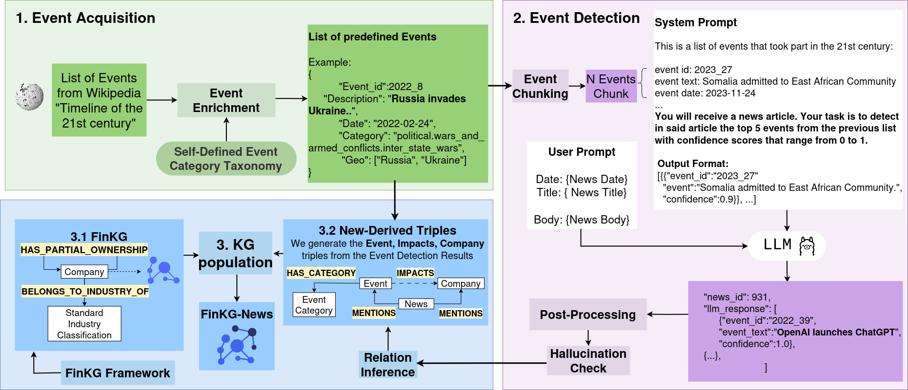
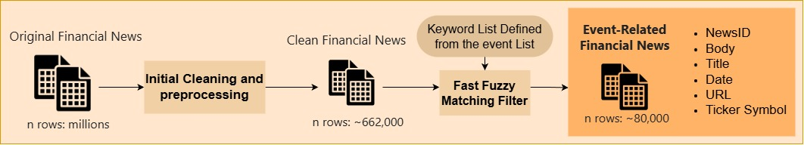

# FinKG-News-Framework

This part of the repository contains the code and resources for generating FinKG-News. We begin by constructing a fixed inventory of historical events. Based on incoming news, we then execute an event detection pipeline comprising several modules: event chunking, prompt engineering, post-processing, and hallucination checking. Using relation inference, we extract and map event-company relationships. Finally, we utilize the inferred triples and their associated relations to populate the FinKG knowledge graph via shared company entities, thereby constructing the complete FinKG-News.



## Contents

1. News Dataset Preprocessing (0.x)
2. Event Acquisition (1.x)
3. Event Detection (2.x)
4. Knowledge Graph Population (3.x)
5. Evaluation

## Pipeline

### 1. News Dataset Preprocessing

The news dataset is progressively reduced to obtain the final set used for event detection.



#### Step 1: Initial Cleaning and EDA

**Notebook:** [`0.1-news_preprocessing-EDA.ipynb`](0.1-news_preprocessing-EDA.ipynb)

Performs exploratory data analysis and preprocessing of the [FNSPID Financial News Dataset](https://github.com/Zdong104/FNSPID_Financial_News_Dataset).

**Processing steps:**
1. Start with the original FNSPID dataset (millions of records).
2. Remove entries with missing values → ~2 million records.
3. Keep only news referring to companies in **S&P 500, 400, and 600** indexes.
4. Remove duplicates → final set of approximately **662,000 distinct news articles**.

#### Step 2: Fast Fuzzy Matching Filtering

**Notebook:** [`0.2-news_preprocessing-fast_fuzzy_search.ipynb`](0.2-news_preprocessing-fast_fuzzy_search.ipynb)

600K+ articles are too many for LLM-based processing. Many news articles do not mention any historical events at all. This notebook applies **fast fuzzy keyword matching** against a predefined event-related vocabulary to reduce the dataset from **~662,000 to ~80,000** articles.

Due to its size, the complete dataset is not included. A reduced sample is available in `filtered_news/`.

---

### 2. Event Acquisition

**Notebook:** [`1-event_acquisition-classification.ipynb`](1-event_acquisition-classification.ipynb)

Events were extracted from Wikipedia and stored in `dict_wiki_timelines5_geo_country_event.json`. This notebook enriches the event set with additional information such as event categories and geographical locations using an LLM. The main processed output is `new_events.json`, and `new_events_with_ids.json` adds unique IDs required for triple files and knowledge graph construction.

All input and output files are in the `event_jsons/` directory:

| File | Description |
|------|-------------|
| `dict_wiki_timelines5_geo_country_event.json` | Original Wikipedia event set (no preprocessing) |
| `new_events.json` | Main processed event list produced by the notebook |
| `new_events_with_ids.json` | Same events with unique IDs for KG construction |

---

### 3. Event Detection

This project uses [Ollama](https://ollama.com/download) for running local LLMs.

#### Model Setup

Download a model:
```sh
ollama pull llama3:70b
```

To use a different model, change `llm_model` in [`2.1-run_event_detection.py`](2.1-run_event_detection.py).

#### Configuration

Key variables in [`2.1-run_event_detection.py`](2.1-run_event_detection.py):

```python
news_csv = "filtered_news/filtered_news_with_keywords_v2.csv"
events_path = "event_jsons/new_events.json"
experiment_name = f"output_detection/experiment_{timestamp}.jsonl"
DEBUG = True
event_chunk_size = 20
token_limit = 2600
llm_model = "llama3:70b"
```

#### Run the Script

```sh
nohup python 2.1-run_event_detection.py &
```

Monitor progress:
```sh
ps aux | grep run_event_detection.py
tail -f nohup.out
```

Output files are saved in the `output_detection/` folder. A reduced example is provided.

#### Post-Processing

**Notebook:** [`2.2-event_detection_post-processing.ipynb`](2.2-event_detection_post-processing.ipynb)

Analyzes event detection results and generates the final **triple files** required for knowledge graph construction.

#### Generated Triple Files

These outputs are stored in `csvTriples/` within the KG population directory:

| File | Description |
|------|--------------|
| `IMPACTS-CORRECT` | Final validated *Event–Impact* triples (confidence ≥ 0.9) |
| `IMPACTS-91percThreshold-CORRECT` | Alternative with stricter threshold (> 0.91), fewer events but higher precision |
| `MENTIONS-COMPANY` | Triples linking *News* to *Company* |
| `MENTIONS-EVENT` | Triples linking *News* to *Event* |

---

### 4. Knowledge Graph Population

**Directory:** [`3-knowledge_graph_population/`](3-knowledge_graph_population/)

Contains scripts for generating and populating the financial knowledge graph using Neo4j. The graph integrates all entities from the original FinKG version and additionally incorporates event and news nodes.

#### Scripts

- **`CoreKG.py`** — Main script for building the knowledge graph with full metadata.
  - `self.company_cik_ticker_10kfilename`: Path to the CSV listing companies (CIK, ticker, 10K file).
  - `self.csv_event_impacts_path`: Choose which IMPACTS CSV to use.
  - Other paths can be adjusted in `__init__`.

- **`neo4j_graph.py`** — Core Neo4j interface for all graph operations.

- **`add_events_to_neo.py`** — Fast deployment using only triple files (CSV format), no metadata.

- **`start_neo4j.py`** — Quick-start script to populate the graph from scratch.

#### Neo4j Connection

Connection settings are read from the repository root `.env` file (`../.env`). Copy `.env.example` from the repo root and set:

```
NEO_URL=bolt://localhost:7687
NEO_USERNAME=neo4j
NEO_PASSWORD=your_password
NEO_DATABASE=finkg-news
```

#### Data & Resources

- **`csvTriples/`** — CSV files with subject-predicate-object triples for companies, events, news, etc.
- **`data/`** — Supporting data files: event/ news metadata, mapping tables, and seed company CSV.

**Example company CSV format:**
```
cik,ticker,10k_filename
0000320193,AAPL,0000320193-21-000010.txt
0000789019,MSFT,0000789019-21-000065.txt
```

---

### 5. Evaluation

**Notebook:** [`evaluation.ipynb`](evaluation.ipynb)
**Dataset:** [`eval_dataset.csv`](eval_dataset.csv)

Evaluates event detection quality on a manually annotated news dataset. Compares predicted events against ground-truth labels using metrics such as F1 score, precision and recall.

---

## Requirements

Install dependencies for the main pipeline:

```sh
pip install -r requirements.txt
```

For the KG population step, install separately:

```sh
pip install -r 3-knowledge_graph_population/requirements.txt
```
